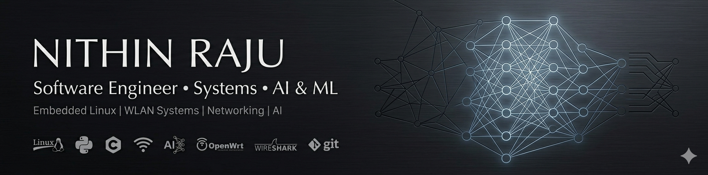

  

# Nithin Raju
  

Embedded Systems • Networking • AI

MSc Computer Science (AI) @ Leiden University  
Former Software Engineer @ embedUR Systems

I work on low-level networking systems, embedded Linux environments, and AI-driven software applications.
Previously, I worked on enterprise WLAN platforms at embedUR Systems, debugging kernel panics, multicast instability, firmware crashes, and MTK driver integrations for Ruckus access points running OpenWrt.
Currently, I am pursuing my MSc in Computer Science (AI specialization) at Leiden University, where I work on reinforcement learning, generative recommender systems, and LLM evaluation projects.

## Interests

- Embedded Linux
- Enterprise WLAN systems
- Networking & distributed systems
- Reinforcement Learning
- LLM evaluation
- Intelligent infrastructure systems
- High-performance software engineering

## Tech Stack

### Systems
C • C++ • OpenWrt • Linux • Networking • GDB • Wireshark • Bash

### AI / ML
PyTorch • Transformers • Reinforcement Learning • scikit-learn

### Development
Python • Git • Docker • JavaScript

